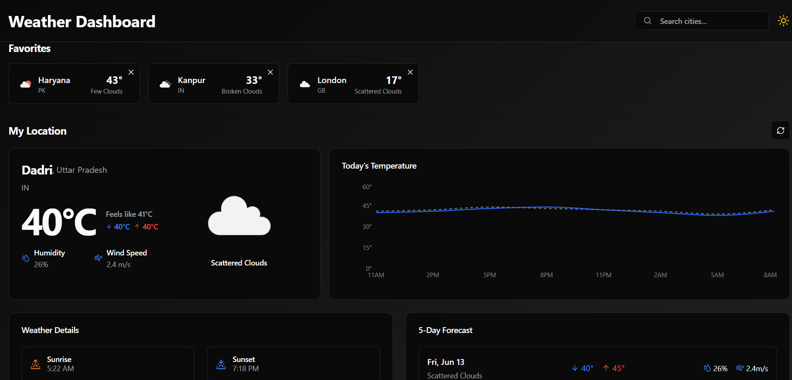
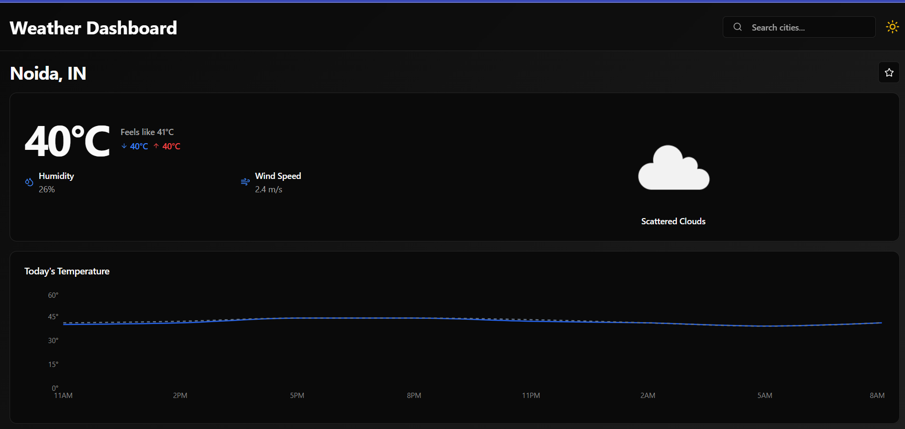

# 🌤️ Weather Dashboard 🌐

A fully responsive and interactive **Weather Dashboard** built using the **MERN stack**. This application allows users to:
- Get real-time weather updates.
- View a 5-day forecast.
- Save recent searches and favorite cities.
- Switch between light and dark themes.
- Automatically detect the current location.

## 📸 Screenshots


### 🏠 Home Page



### 📍 Forecast & City View



---

## 🧩 Features

- 🔍 **Search Weather** by city name.
- 🗓️ **5-Day Forecast** with min/max temperature, humidity, and wind info.
- 📌 **Recent Search History** (stored in local storage and MongoDB).
- ⭐ **Favorite Cities** for quick access.
- 📍 **Current Location Weather** using Geolocation API.
- 🌓 **Dark / Light Mode Toggle**.
- ⚡ **Real-Time API Integration** with OpenWeatherMap.

---

## 🚀 Live Demo

[🔗 Click Here to View Live](https://your-deployment-link.vercel.app)  
*(Replace this with your actual deployment URL)*

---

## 🛠️ Tech Stack

| Technology | Description |
|------------|-------------|
| **React.js** | Frontend framework |
| **TypeScript** | Static typing |
| **TailwindCSS** | UI styling |
| **Node.js** + **Express** |
| **OpenWeatherMap API** | Weather data provider |
| **React Query** | Data fetching and caching |
| **Vite** | Frontend bundler |
| **Lucide React** | Icon library |

---

## 📦 Getting Started

### Prerequisites

- Node.js ≥ 18
- OpenWeatherMap API Key

---

### 🧑‍💻 Local Setup

```bash
# 1. Clone the repository
git clone https://github.com/your-username/weather-dashboard.git
cd weather-dashboard

# 2. Install dependencies
npm install

# 3. Create environment variables
touch .env
